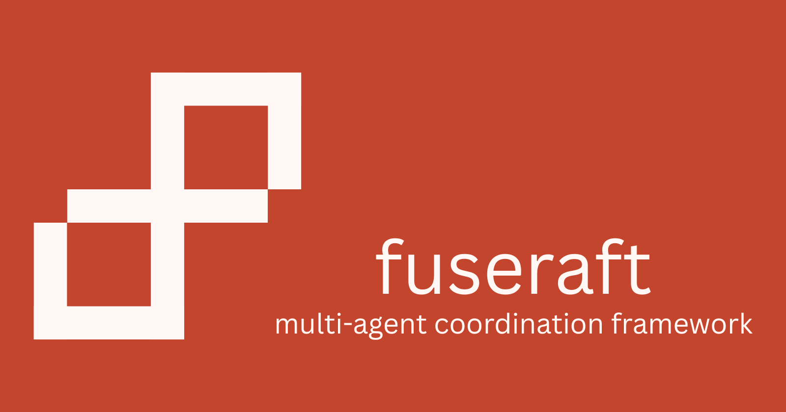

# fuseraft for VS Code



Run and manage [fuseraft](https://github.com/fuseraft/fuseraft-cli) multi-agent orchestrations without leaving your editor.

## Features

### Activity Bar Panel

A dedicated fuseraft panel in the activity bar gives you four persistent views:

**Run Task** — a webview form for composing and launching tasks:
- Multi-line textarea for your task description (paste prose, markdown specs, or bullet lists)
- **+ Files** button — attach files or folders as context. Each attached file is passed to the CLI via `--context-file` and its content is appended to the task. Folders expand to their immediate non-hidden children (up to 20 files total). Attached files appear as removable chips below the textarea. You can also drag files from the VS Code Explorer or your OS file manager onto the task section.
  - PDF, DOCX, PPTX, and XLSX files are automatically extracted to plain text by the CLI — attach documents directly without any manual conversion.
- Config dropdown auto-populated from configs found in your workspace
- Checkboxes for common flags:
  - **Human-in-the-loop** (`--hitl`) — pause after every agent turn to review or redirect
  - **Show tool calls** (`--tools`) — print tool invocations inline in the output
  - **Verbose** (`--verbose`) — enable debug logging and token counts
  - **DevUI** (`--devui`) — open real-time session visualization in the browser
- **Run Task** button (`Ctrl+Enter`) — opens a dedicated terminal named after the first 40 characters of your task. Multiple tasks can run simultaneously, each in their own terminal.
- **Run Task File…** button — opens a file picker to select a `.md` or `.txt` task file

**Sessions** — lists sessions from `~/.fuseraft/sessions/` scoped to the current workspace (filtered by config path). Shows session ID, task preview, age, and status. The list auto-refreshes as sessions change on disk.
- Click an incomplete session to resume it in the terminal
- Click the preview icon or right-click → **View Session Transcript** to open a formatted transcript panel for any session (complete or incomplete)
- Right-click → **Open Session Config** to jump to the config used for a session
- Right-click → **Delete Session** to permanently remove a session

**Configs** — discovers every YAML or JSON file in your workspace that contains an `Orchestration:` key. Click any config to open it. The list updates automatically when files are added or removed. Click **+** in the toolbar to run the Initialize Config wizard.

**Context** — manages reference material that agents can access during sessions. Items are stored in `.fuseraft/context/` relative to your workspace root and auto-refresh when the index changes.
- Click **+** in the toolbar or right-click → **Add Context** to import a file or folder. You will be prompted for an optional name (defaults to the filename) and description.
- Right-click any item → **Remove Context Item** to delete it and its copied files
- Hover over an item to see its source path, import time, and file count

### Session Transcript Viewer

Click the preview icon next to any session to open a rich transcript panel showing:
- Session metadata: ID, task, config path, start time, completion status
- Every agent turn as a card with a color-coded header per agent
- Tool calls with ✓ / ✗ status indicators and argument summaries (click the label to collapse)
- Per-turn token usage (input / output) and cost
- Session-level totals: turn count, total tokens, total cost

### CodeLens on Config Files

When you open a fuseraft config, three inline actions appear above the first line:

```
▶ Run Task   ✓ Validate   ⎇ Diagram
```

### Right-Click Menus

**Config files** (`orchestration.yaml`, `*.fuseraft.yaml`, etc.) — right-click in the file explorer or inside the editor:
- **Run Task with This Config**
- **Validate Config**
- **Validate Config and Show Diagram**

**Task files** (`.md`, `.txt`) — right-click in the file explorer or inside the editor:
- **Run Task File with fuseraft** — runs `fuseraft run -f <file>`, prompting for a config if multiple are found

### Command Palette

All commands are available via `Ctrl+Shift+P` / `Cmd+Shift+P` under the `fuseraft:` prefix:

| Command | Description |
|---------|-------------|
| `fuseraft: Run Task` | Prompt for a task, pick a config, and run in the integrated terminal |
| `fuseraft: Run Task File with fuseraft` | Run a `.md` or `.txt` task file with `fuseraft run -f` |
| `fuseraft: Initialize Config` | 4-step wizard: template, model, provider endpoint, output path |
| `fuseraft: Validate Config` | Validate a config file and print results |
| `fuseraft: Validate Config and Show Diagram` | Validate and print a Mermaid flowchart of the pipeline |
| `fuseraft: Open REPL` | Start an interactive single-agent chat session |
| `fuseraft: Resume Session` | Pick an incomplete session to resume |
| `fuseraft: View Session Transcript` | Open a formatted transcript for a session |
| `fuseraft: Add Context` | Import a file or folder into the session context store |
| `fuseraft: Remove Context Item` | Remove a context item and delete its copied files |
| `fuseraft: Set Up Provider` | Configure your AI provider, model, API key, and binary path |

### Initialize Config Wizard

`fuseraft: Initialize Config` walks through four steps:

1. **Template** — choose from all available templates:

   | Template | Description |
   |----------|-------------|
   | `dev-team` | Planner → Developer → Tester → Reviewer with keyword routing and a periodic Verifier |
   | `graph` | Same four-agent pipeline as a declarative directed graph with back-edges for revision cycles |
   | `brownfield` | Archaeologist recons the codebase first, then Planner → Developer → Reviewer |
   | `brownfield-graph` | Brownfield pipeline as a directed graph; Reviewer has separate back-edges to Developer and Planner |
   | `magentic` | Manager LLM dynamically coordinates Researcher + Developer agents (no fixed routing) |
   | `research` | Researcher gathers information, Writer produces the final report |
   | `devops` | Three-agent pipeline for infrastructure and deployment tasks |
   | `content` | Writer drafts, Editor refines and approves |
   | `minimal` | Single general-purpose agent — simplest possible setup |
   | `designer` | Describe your use case in plain language and get a validated config back |

2. **Model** — pick from common models across all providers, use auto-detection, or type any model ID
3. **Provider endpoint** — pick a known provider URL, use your saved default, or enter a custom URL
4. **Output path** — defaults to `config/orchestration.yaml`, fully editable

The generated config file opens automatically in the editor as soon as fuseraft writes it to disk.

### Set Up Provider

`fuseraft: Set Up Provider` runs automatically on first use when the fuseraft binary is not found or when `~/.fuseraft/config` is missing or incomplete. You can also invoke it at any time from the command palette.

It opens a **Set Up Provider** panel — a single form with all fields visible at once:

- **Binary** — path to the fuseraft binary. Click **Browse…** to pick one from disk, or **Validate** to verify the current path. The panel shows the detected version inline.
- **Preset** — choose from Anthropic, OpenAI, xAI, Google, Mistral, DeepSeek, or Custom / Self-hosted. Selecting a preset auto-fills the endpoint URL and suggests models, but both fields remain fully editable.
- **Endpoint URL** — the provider's API base URL.
- **Model** — the model ID to use. Typing opens suggestions for the selected provider, or enter any ID directly.
- **API Key** — paste your key. Stored in `~/.fuseraft/config`; migrated to your OS keychain the next time you run `fuseraft repl`.

Click **Test Connection** to verify the key against the provider — the result appears inline without leaving the form. Click **Save** when ready.

### Status Bar

A `fuseraft` button is always visible in the status bar. Click it to run a task.

### YAML / JSON IntelliSense

The extension ships a full JSON Schema for fuseraft config files. You get autocomplete, inline documentation, and validation for all fields — `Agents`, `Models`, `Plugins`, `Capabilities`, `Contracts`, `Routes`, `Security`, `Compaction`, and more.

Schema validation is enabled automatically for files matching `**/orchestration.json` and `**/*.fuseraft.json`. For YAML files, add this to your VS Code settings (requires the [YAML extension](https://marketplace.visualstudio.com/items?itemName=redhat.vscode-yaml)):

```json
"yaml.schemas": {
  "<extension-path>/schemas/fuseraft-config.schema.json": [
    "**/orchestration.yaml",
    "**/*.fuseraft.yaml"
  ]
}
```

Or reference the schema inline at the top of any config file:

```yaml
# yaml-language-server: $schema=<extension-path>/schemas/fuseraft-config.schema.json
Orchestration:
  Name: MyTeam
  ...
```

## Requirements

- [fuseraft CLI](https://github.com/fuseraft/fuseraft-cli) must be installed and on your `PATH` (or its path set in extension settings).
- VS Code 1.85 or later.

## Extension Settings

| Setting | Default | Description |
|---------|---------|-------------|
| `fuseraft.binaryPath` | `fuseraft` | Path to the fuseraft binary. Can be absolute (e.g. `/usr/local/bin/fuseraft`) or relative. If not on `PATH`, set to an absolute path. The extension validates this on startup and prompts to configure if invalid. |
| `fuseraft.defaultConfigPath` | _(blank)_ | Default config path relative to workspace root. Leave blank to be prompted each time. |
| `fuseraft.runFlags` | _(blank)_ | Extra flags appended to every `fuseraft run` invocation (e.g. `--tools --verbose`). |
| `fuseraft.openTerminalOnRun` | `true` | Focus the integrated terminal when a task starts. |

## Development

```bash
# Install dependencies
npm install

# Compile
npm run compile

# Watch mode
npm run watch
```

Press `F5` in VS Code to launch an Extension Development Host with the extension loaded.

To package:

```bash
npx vsce package
```

## License

MIT
