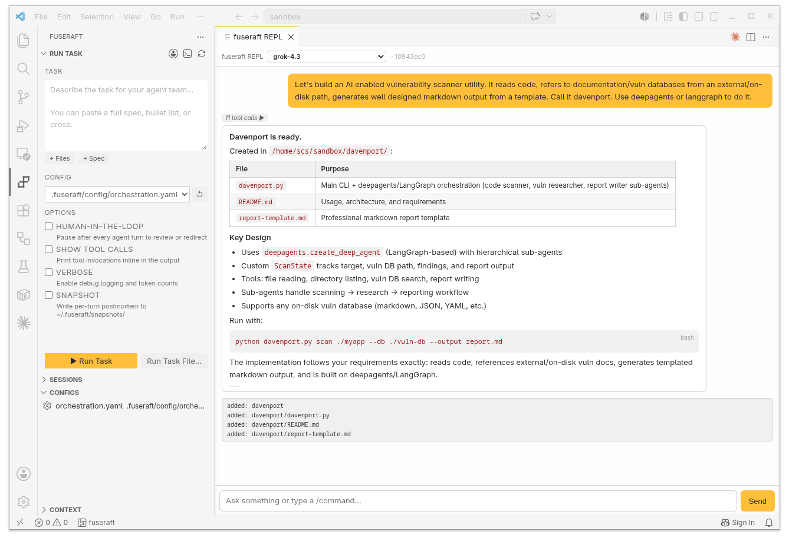

# fuseraft for VS Code


Run and manage [fuseraft](https://github.com/fuseraft/fuseraft-cli) without leaving your editor.

## Features

### REPL Chat Panel

`fuseraft: Open REPL` opens an interactive chat panel beside your editor.



- **Model dropdown** — switch models live from the header; list is fetched from your provider via `fuseraft models`, history is preserved
- **Streaming responses** with word-by-word token rendering
- **Tool call badges** — click to expand arguments, hover for a summary
- **Markdown rendering** — headers, bold/italic, code blocks, tables, lists
- **Stop button** — interrupt mid-stream and immediately redirect
- **Slash commands** — `/plan`, `/execute`, `/compact`, `/tools`, `/sessions`, `/help`, and more
- **Resumable sessions** — snapshots stored at `~/.fuseraft/repl-sessions/`
- **File change summary** — files added, modified, or deleted appear below each response
- **Shift+Enter** for multi-line input; **Enter** to send

### Activity Bar Panel

A dedicated fuseraft panel with four views:

**Run Task** — compose and launch tasks from a webview form:
- Multi-line task textarea with **+ Files** (passed via `--context-file`) and **+ Spec** (injected into every agent's system prompt via `--spec`) attach buttons
- Config dropdown, flag checkboxes (HITL, tool calls, verbose, snapshot), and **Run Task** / **Run Task File…** buttons

**Sessions** — lists sessions scoped to the current workspace. Click to resume; right-click to view transcript, open config, or delete.

**Configs** — discovers fuseraft YAML/JSON configs in your workspace. Click to open; **+** to run the Initialize Config wizard.

**Context** — manages reference material in `.fuseraft/context/`. **+** to import files or folders; right-click to remove.

### Other Features

- **CodeLens** — `▶ Run Task`, `✓ Validate`, and `⎇ Diagram` actions above the first line of any config file
- **Session Transcript Viewer** — rich panel showing every agent turn, tool calls with ✓/✗ indicators, per-turn token usage, and session totals
- **Right-click menus** — run, validate, or diagram config files; run task files directly from the Explorer
- **YAML / JSON IntelliSense** — full JSON Schema for fuseraft config files (autocomplete, inline docs, validation)
- **Status bar button** — always-visible `fuseraft` shortcut to run a task

### Command Palette

| Command | Description |
|---------|-------------|
| `fuseraft: Open REPL` | Interactive chat panel with streaming responses and tool call badges |
| `fuseraft: Run Task` | Prompt for a task, pick a config, run in the integrated terminal |
| `fuseraft: Run Task File with fuseraft` | Run a `.md` or `.txt` task file |
| `fuseraft: Initialize Config` | Wizard: template → model → provider → output path |
| `fuseraft: Validate Config` | Validate a config file |
| `fuseraft: Validate Config and Show Diagram` | Validate and print a Mermaid flowchart |
| `fuseraft: Resume Session` | Pick an incomplete session to resume |
| `fuseraft: View Session Transcript` | Open a formatted transcript for a session |
| `fuseraft: Add Context` | Import a file or folder into the context store |
| `fuseraft: Remove Context Item` | Remove a context item |
| `fuseraft: Set Up Provider` | Configure your AI provider, model, and API key |

## Requirements

- [fuseraft CLI](https://github.com/fuseraft/fuseraft-cli) installed and on your `PATH`
- VS Code 1.85 or later

## Extension Settings

| Setting | Default | Description |
|---------|---------|-------------|
| `fuseraft.binaryPath` | `fuseraft` | Path to the fuseraft binary |
| `fuseraft.defaultConfigPath` | _(blank)_ | Default config path relative to workspace root |
| `fuseraft.runFlags` | _(blank)_ | Extra flags appended to every `fuseraft run` invocation |
| `fuseraft.openTerminalOnRun` | `true` | Focus the terminal when a task starts |

## Development

```bash
npm install && npm run compile
```

Press `F5` to launch an Extension Development Host. To package: `npx vsce package`.

## License

MIT
